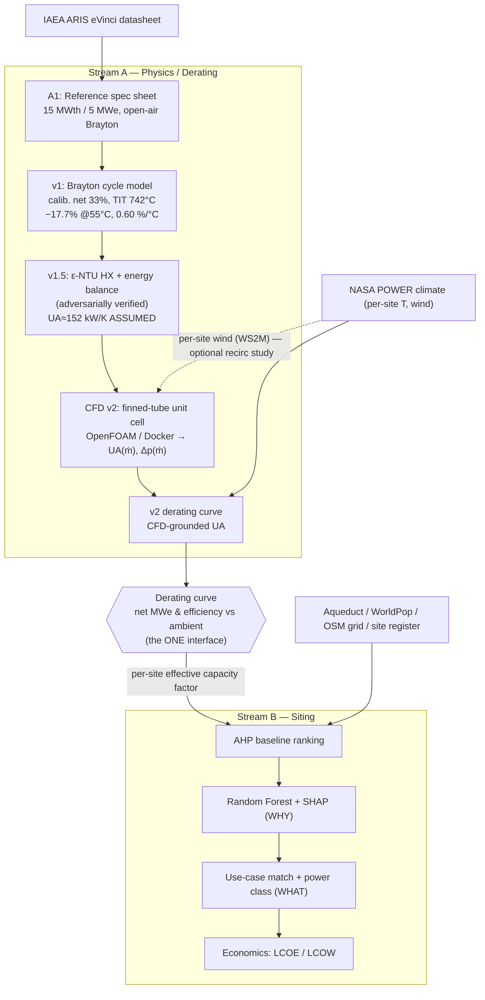
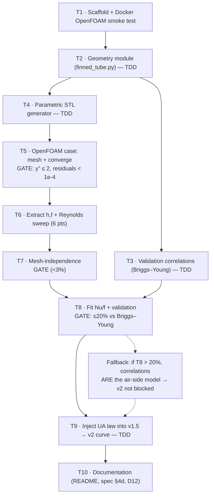

# Project Pipeline Diagrams

Rendered views of the combined derating → siting workflow. Mermaid source (paste into
GitHub / VS Code / https://mermaid.live to view). Kept in sync with `DECISIONS_LOG.md`.

## 1. Overall combined-project pipeline

## 2. CFD v2 implementation pipeline (the 10-task plan)

## Legend
- Solid arrow = data/artifact dependency · dashed = optional/fallback path.
- `{{ }}` = the single interface artifact (`derating_curve_vN.csv`) coupling the two streams.
- GATE = a hard acceptance check that must pass before the next step is trusted.
